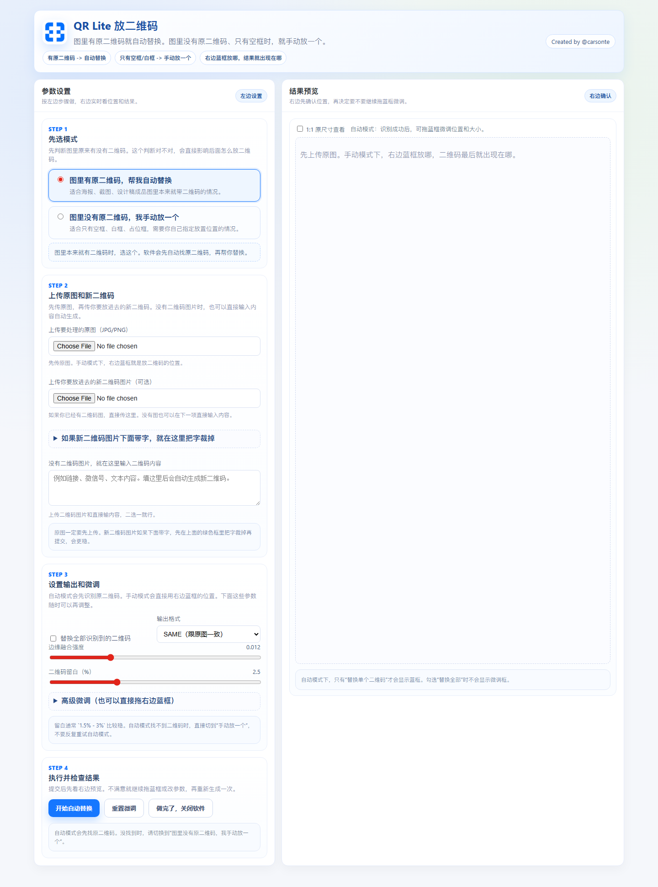

# QR Lite

[English](README.md) | [简体中文](README.zh-CN.md)

<p align="center">
  
</p>

<p align="center">
  
  
  
  
</p>

QR Lite is a local QR code replacement tool built for design, operations, and marketing workflows where people need to update images quickly without opening a full design suite.

It can replace an existing QR code automatically, or add a new one manually when the source image only has an empty placeholder box.

## Why QR Lite

- Fast QR replacement for posters, promo graphics, and print assets
- Two workflows: auto replace and manual placement
- Direct, simple UI copy designed for non-technical teammates
- Better support for `CMYK JPEG` source images
- Optimized for large images and lower-end laptops

## Features

- Automatically detects and replaces QR codes in source images
- Manual placement mode for empty boxes, white boxes, and placeholders
- Drag-and-resize blue box for placement fine-tuning
- Upload a QR image or generate one from text
- Crop away extra text under the uploaded QR image
- Preserves ICC profile / DPI / EXIF whenever possible
- Keeps output as `CMYK JPEG` when replacing an `RGB` QR code inside a `CMYK JPEG` source
- Large-image performance improvements for weaker machines

## Screenshots

<table>
  <tr>
    <td width="50%">
      
    </td>
    <td width="50%">
      
    </td>
  </tr>
  <tr>
    <td align="center">Auto replace mode</td>
    <td align="center">Manual placement mode</td>
  </tr>
</table>

## Modes

### Auto Replace

Use this when the source image already contains a QR code.  
QR Lite detects the QR region first, then replaces it with the new QR code.

### Manual Placement

Use this when the source image does not contain a QR code and only has an empty frame or placeholder.  
Place the blue box where the new QR code should go, then generate the result.

## CMYK-Safe Output

When the source image is a `CMYK JPEG` and the output stays in `JPEG`, QR Lite uses a dedicated `CMYK` processing path to avoid unnecessary full-image round-trip color conversion.

This makes it more suitable for posters, print-ready graphics, and JPEG assets with embedded color profiles.

## Performance

QR Lite includes several optimizations for large images:

- QR detection runs on a downscaled preview first, then maps coordinates back
- Perspective blending only processes the local QR region instead of the whole image
- Heavy modules are loaded lazily to reduce startup stalls

## Quick Start

### Requirements

- Python 3.11
- Windows recommended

### Run From Source

```powershell
git clone https://github.com/carsonte/QR-Lite.git
cd QR-Lite
python -m pip install -r requirements.txt
python launcher.py
```

If `python` is not available on your machine, use:

```powershell
py -m pip install -r requirements.txt
py launcher.py
```

After launch, a startup window appears first and then opens the browser automatically.  
If the browser does not open, visit the local URL printed in the terminal, usually:

```text
http://127.0.0.1:7860
```

## How To Use

1. Decide whether the source image already has a QR code
2. Choose `Auto Replace` or `Manual Placement`
3. Upload the source image
4. Upload a new QR image or enter QR content as text
5. In manual mode, drag the blue box to the target area
6. Generate the result
7. Fine-tune and regenerate if needed
8. Download the final image

## Packaging

The repository keeps one official packaging format: `onedir`

```powershell
.\build_exe.ps1
```

The packaged app is generated at:

```text
dist\QRLite\QRLite.exe
```

Notes:

- This is a directory-based build, not a single-file executable
- Share the whole `dist/QRLite` folder with teammates
- Zipping the full folder is the recommended distribution method

## Release Notes

The first release notes draft is available here:

- [v1.0.0 Release Notes](docs/releases/v1.0.0.md)

You can reuse it directly when creating a GitHub Release.

## Repository Layout

```text
app.py                 FastAPI server
launcher.py            Windows launcher window
qr_replace.py          QR detection and replacement core
web/                   Frontend page
branding/              Branding assets
docs/                  Screenshots and release notes
build_exe.ps1          Packaging script
QRLite.spec            PyInstaller spec
```

## GitHub Notes

- Build and test artifacts such as `dist/`, `build/`, `tmp_test/`, and `output/` are ignored
- Packaged builds should go to GitHub Releases, not repository history
- The project currently prioritizes stability, compatibility, and maintainability over maximum size reduction

## Current Status

This version already includes:

- Manual QR placement mode
- Mode-switch state fixes
- Startup freeze fix
- `Tcl_AsyncDelete` shutdown fix
- Large-image performance improvements
- `CMYK + RGB QR` color-safe processing
- Packaging size and dependency cleanup

## License

This project is licensed under the [MIT License](LICENSE).
