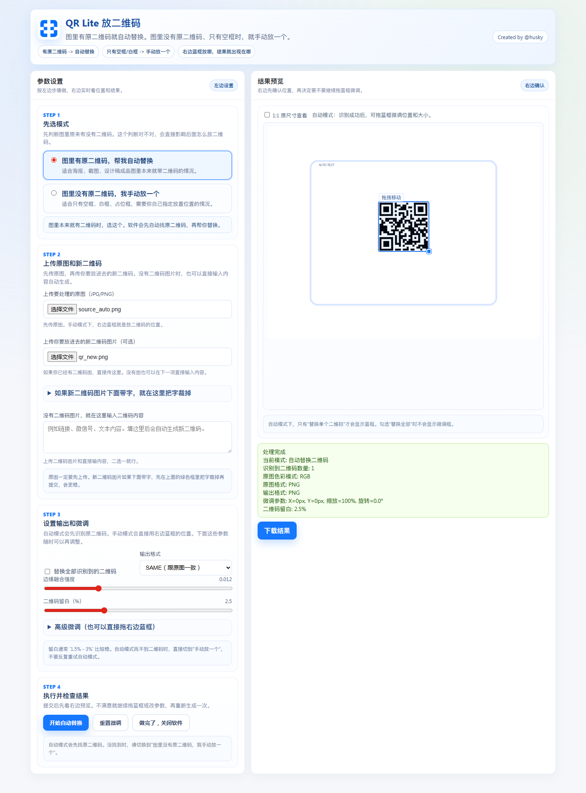
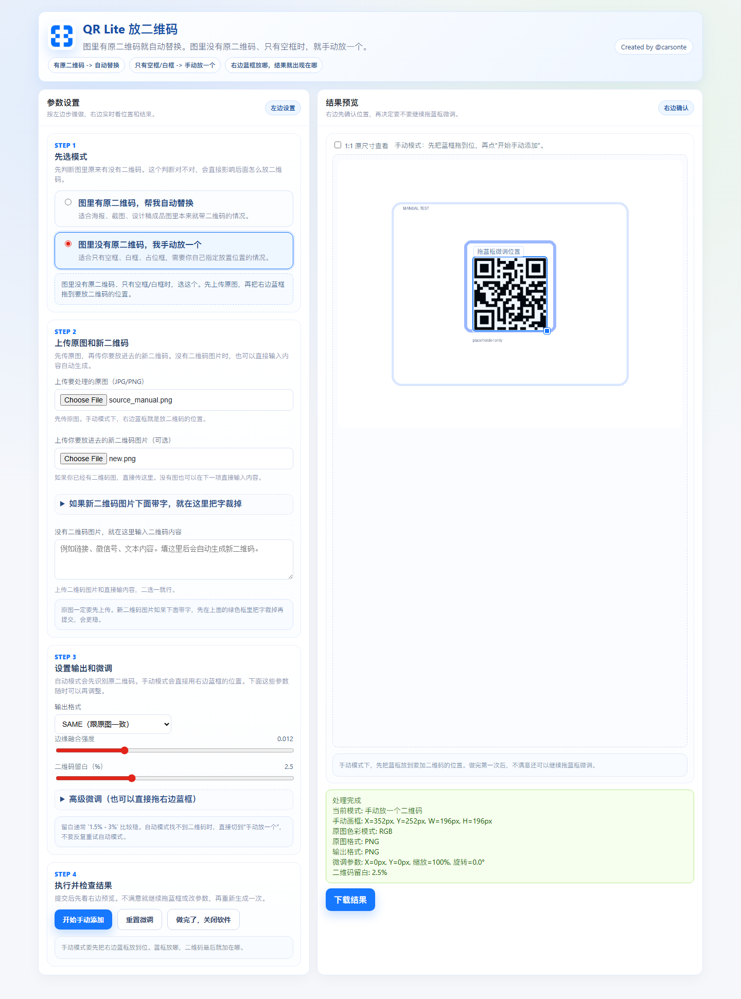

# QR Lite

[English](README.md) | [简体中文](README.zh-CN.md)

<p align="center">
  <a href="https://github.com/carsonte/QR-Lite/releases">
    
  </a>
  <a href="https://github.com/carsonte/QR-Lite/stargazers">
    
  </a>
  
  
  
  
</p>

<p align="center">
  一个本地二维码替换工具，适合海报、宣传图、物料图和印刷图稿。
  <br>
  图里有原二维码就自动替换，图里只有空框就手动画框放一个。
</p>

<p align="center">
  QR Lite 可以理解成一个本地的 <strong>QR code replacement tool</strong> / <strong>QR code replacer for images</strong>。
  <br>
  适合 <strong>replace QR codes in posters, screenshots, flyers, and marketing assets</strong> 这类需求，
  也适合在只有空框时做 <strong>manual QR placement</strong>。
  <br>
  对需要 <strong>CMYK-safe QR replacement</strong> 的印刷图稿场景也更友好。
</p>

<p align="center">
  <a href="https://github.com/carsonte/QR-Lite/releases"><strong>下载 Windows 版本</strong></a>
  &middot;
  <a href="docs/releases/v1.0.0.md"><strong>查看 Release 说明</strong></a>
  &middot;
  <a href="docs/launch-kit.md"><strong>查看发布素材</strong></a>
</p>

<p align="center">
  
</p>

如果这个项目帮你省了时间，点一个 GitHub Star 会很有帮助，也能让更多人在找二维码替换工具时看到它。

## 为什么用 QR Lite

- 适合海报、宣传图、物料图的二维码快速替换
- 同时支持自动替换和手动放置两种流程
- 页面文案尽量写成“下一步该做什么”，适合直接给同事使用
- 对 `CMYK JPEG` 原图更友好
- 针对大图和弱性能笔记本做过优化

## 功能特性

- 自动识别并替换原图中的二维码
- 手动放置模式，适合空框 / 白框 / 占位框
- 支持拖拽蓝框微调位置和大小
- 支持上传二维码图片，或直接输入内容生成二维码
- 支持裁掉二维码图片下方说明文字
- 尽量保留 ICC Profile / DPI / EXIF
- 当原图是 `CMYK JPEG` 时，替换 `RGB` 二维码后仍可保持 `CMYK JPEG`
- 对大图做了性能优化，低配设备上的等待时间更短

## 截图

<table>
  <tr>
    <td width="50%">
      
    </td>
    <td width="50%">
      
    </td>
  </tr>
  <tr>
    <td align="center">自动替换模式</td>
    <td align="center">手动放置模式</td>
  </tr>
</table>

## 下载

给同事分发时，最推荐的格式是 GitHub Releases 里的 `onedir` zip 包。

本地生成 release zip 的命令：

```powershell
powershell -ExecutionPolicy Bypass -File .\scripts\build_release_zip.ps1 -Version v1.0.0
```

生成结果在：

```text
output\release\QRLite-v1.0.0-windows-x64.zip
```

## 快速开始

### 环境要求

- Python 3.11
- 推荐在 Windows 上使用

### 从源码运行

```powershell
git clone https://github.com/carsonte/QR-Lite.git
cd QR-Lite
python -m pip install -r requirements.txt
python launcher.py
```

如果本机没有 `python` 命令，也可以改用：

```powershell
py -m pip install -r requirements.txt
py launcher.py
```

启动后会先显示启动窗口，然后自动打开浏览器。
如果浏览器没有自动打开，可以访问终端里打印的本地地址，通常是：

```text
http://127.0.0.1:7860
```

## 使用流程

1. 先判断原图里有没有原二维码
2. 选择 `自动替换` 或 `手动放一个`
3. 上传原图
4. 上传新的二维码图片，或者直接输入二维码内容
5. 手动模式下，把右侧蓝框拖到目标区域
6. 开始生成
7. 不满意就继续微调，再重新生成
8. 下载结果图

## 两种模式

### 自动替换

适合原图里本来就有二维码的情况。
QR Lite 会先识别二维码区域，再替换成新的二维码。

### 手动放置

适合原图里没有二维码、只有空框或占位框的情况。
你只需要把蓝框拖到目标位置，然后生成结果。

## CMYK 输出说明

当原图是 `CMYK JPEG` 且输出保持为 `JPEG` 时，QR Lite 会走专门的 `CMYK` 处理路径，尽量避免整张图来回转色。

这让它更适合海报、印刷物料以及带 ICC 配置的 JPEG 成品图。

## 性能优化

针对大图场景，这个项目已经做了这些优化：

- 二维码识别先在缩小图上进行，再映射回原图坐标
- 透视贴图只处理二维码附近的局部区域，不再每次处理整张大图
- 启动时延后加载重模块，减少打开软件时的卡顿感

## 打包

仓库当前只保留一个正式打包方案：`onedir`

```powershell
.\build_exe.ps1
```

打包后的程序在：

```text
dist\QRLite\QRLite.exe
```

注意：

- 这是目录版，不是单文件版
- 分发给同事时，要发整个 `dist/QRLite` 文件夹
- 更推荐把整个目录打成 zip 后再分发

## Release 说明

- [v1.0.0 Release Notes](docs/releases/v1.0.0.md)

## 发布支持

- [Launch Kit](docs/launch-kit.md)
- [README 截图生成脚本](scripts/capture_readme_screenshots.py)

## 仓库结构

```text
app.py                 FastAPI 服务端
launcher.py            Windows 启动窗口
qr_replace.py          二维码识别与替换核心
web/                   前端页面
branding/              品牌素材
docs/                  截图和 Release 文档
scripts/               截图和发布辅助脚本
build_exe.ps1          打包脚本
QRLite.spec            PyInstaller 配置
```

## GitHub 说明

- `dist/`、`build/`、`tmp_test/`、`output/` 这些构建和测试产物已经被忽略
- 正式包更适合放到 GitHub Releases，而不是直接提交进仓库历史
- 当前项目优先保证稳定性、兼容性和可维护性，其次才是继续压缩体积

## 开源协议

本项目使用 [MIT License](LICENSE) 开源。
